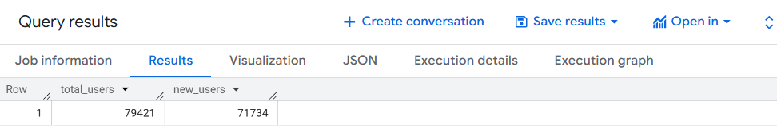
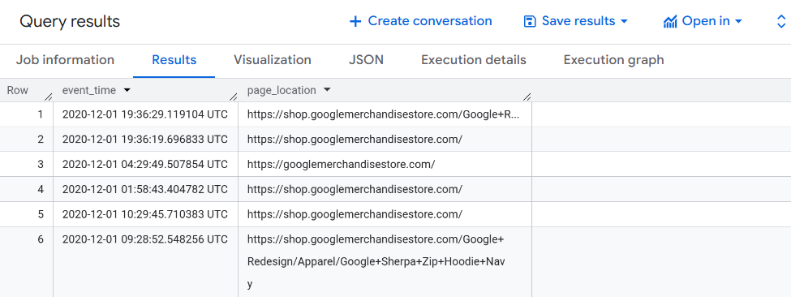
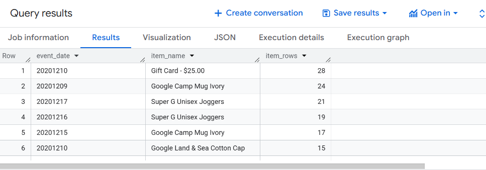
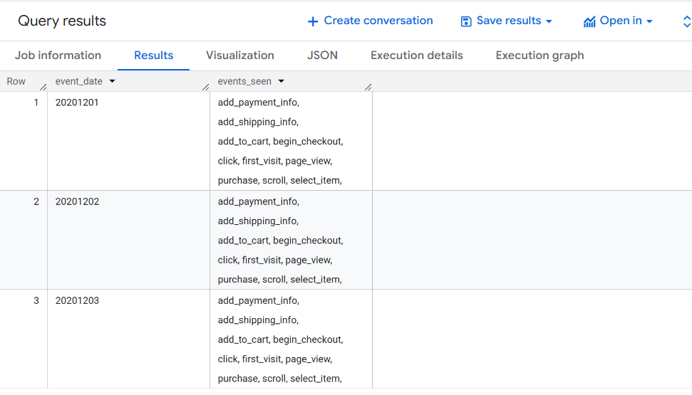
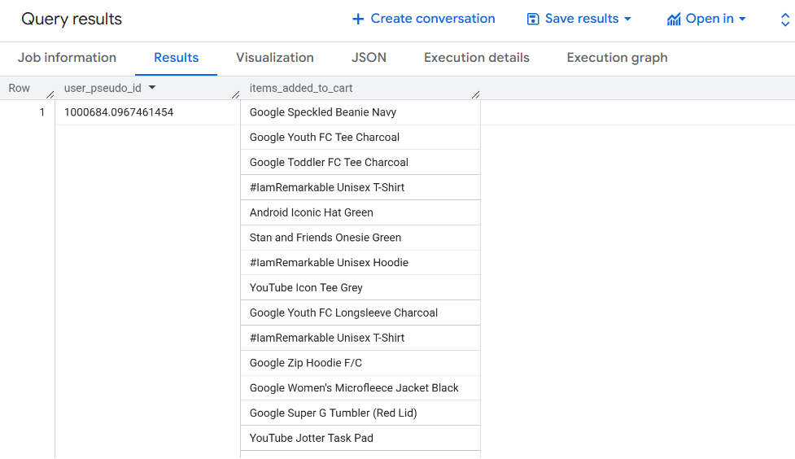
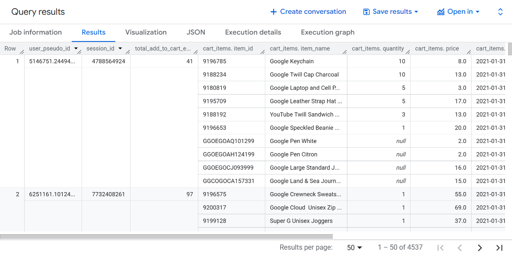
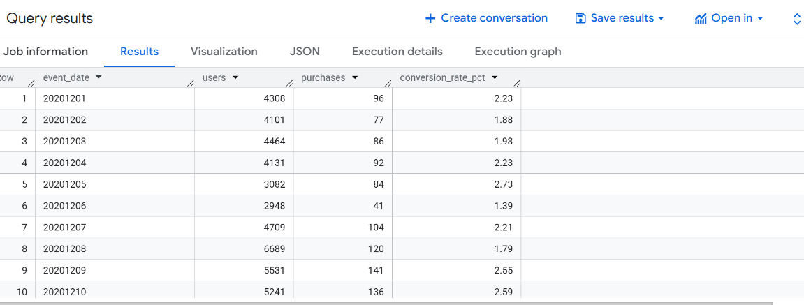
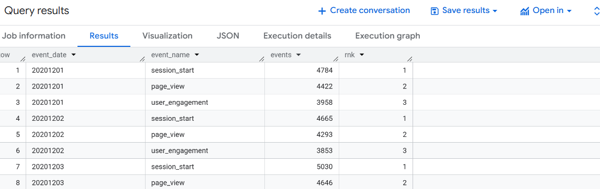
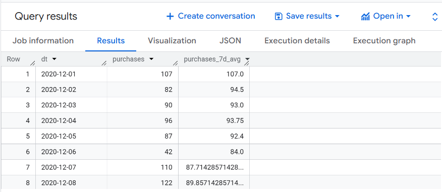
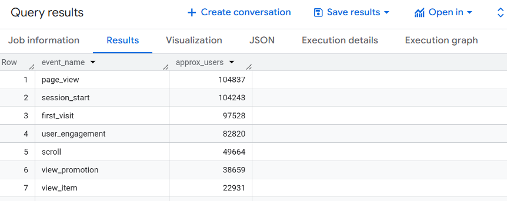

::: callout-note
1.  Note: This is a lecture note for BigQuery. It is not a comprehensive guide to SQL or BigQuery, but rather a collection of examples and explanations to help you get started with querying data in BigQuery.

2.  The examples in this lecture note use the `bigquery-public-data.ga4_obfuscated_sample_ecommerce.events_*` dataset, which is a sample dataset provided by Google that contains anonymized e-commerce event data. You can use this dataset to practice writing SQL queries and exploring the data.

3.  To learn the definitions of GA4 data, please refer to the [GA4 BigQuery Export Schema](https://support.google.com/analytics/answer/7029846#zippy=%2Cevent) documentation. This will help you understand the structure of the data and the meaning of the various fields in the dataset.
:::

# CTEs (WITH) to structure logic

::: callout-tip
-   CTEs (Common Table Expressions) let you break complex queries into named subqueries.

-   **What it does**: creates named “mini tables” inside a query.
:::

## Sample use cases:

> **Task**: Produce the number of all total users + new users for the month of November 2020.

``` sql
WITH UserInfo AS (
    SELECT
        user_pseudo_id,
        MAX(IF(event_name IN ('first_visit', 'first_open'), 1, 0)) AS is_new_user
    FROM `bigquery-public-data.ga4_obfuscated_sample_ecommerce.events_*`
    WHERE _TABLE_SUFFIX BETWEEN '20201101' AND '20201130'
    GROUP BY user_pseudo_id
)
SELECT
    COUNT(*) AS total_users,
    SUM(is_new_user) AS new_users
FROM UserInfo;
```

## Output:



# Arrays + UNNEST (the GA4 superpower)

::: callout-tip
GA4 stores lots of fields inside arrays: - event_params (key/value pairs)

-   items (products in commerce events)
:::

> There are two common patterns:

## Pattern A — Scalar subquery extraction (simple, safe)

> Pull one parameter from `event_params` without exploding rows.

### Use Case

``` sql
SELECT
    TIMESTAMP_MICROS(event_timestamp) AS event_time,
    (
    SELECT value.string_value
    FROM UNNEST(event_params)
    WHERE key = 'page_location' LIMIT 1 
    ) AS page_location
FROM `bigquery-public-data.ga4_obfuscated_sample_ecommerce.events_*`
WHERE event_name = 'page_view'
    AND _TABLE_SUFFIX BETWEEN '20201201' AND '20201202'
LIMIT 50;
```

### Output



## Pattern B — Flattening (UNNEST in FROM) for item-level analysis

> This multiplies rows (one event can have many items).

### Use Case

``` sql
SELECT 
    event_date,
    item.item_name,
    COUNT(*) AS item_rows
FROM `bigquery-public-data.ga4_obfuscated_sample_ecommerce.events_*` e,
UNNEST(e.items) AS item
WHERE e.event_name = 'purchase'
    AND _TABLE_SUFFIX BETWEEN '20201201' AND '20201231'
GROUP BY event_date, item.item_name
ORDER BY item_rows DESC
LIMIT 20;
```

### Output



::: callout-important
UNNEST changes the “grain.” After unnesting items, you’re no longer at “event-level”; you’re at “item-row per event.”

**When to use which pattern?**

-   Use Pattern A when you need a specific value from an array without duplicating rows.

-   Use Pattern B when you need to analyze each item within an event.
:::

# STRING_AGG, ARRAY_AGG (useful aggregations)

::: callout-tip
**What they do**: combine many values into one row per group.
:::

## STRING_AGG

**Task**: show a few event_names seen per day

### Use Case

``` sql
SELECT
    event_date,
    STRING_AGG(DISTINCT event_name, ', ' ORDER BY event_name) AS events_seen
FROM `bigquery-public-data.ga4_obfuscated_sample_ecommerce.events_*`
WHERE _TABLE_SUFFIX BETWEEN '20201201' AND '20201203'
GROUP BY event_date
ORDER BY event_date;
```

### Output



## ARRAY_AGG

::: callout-tip
**What it does**: ARRAY_AGG collects multiple rows of values and packages them into a single ARRAY (list)
:::

### Use Case

**Task**: Create a list of items per session

``` sql
SELECT
    user_pseudo_id,
    ARRAY_AGG(item_name) AS items_added_to_cart
FROM `bigquery-public-data.ga4_obfuscated_sample_ecommerce.events_*`,
UNNEST(items) AS item
WHERE event_name = 'add_to_cart'
AND _TABLE_SUFFIX BETWEEN '20201201' AND '20201231'
GROUP BY user_pseudo_id
ORDER BY user_pseudo_id
LIMIT 10;
```

### Output



### Use Case

**Task**: Session-level "cart summary" using ARRAY_AGG

``` sql
WITH add_to_cart AS (
  SELECT
    user_pseudo_id,
    (
      SELECT value.int_value 
      FROM UNNEST(event_params) 
      WHERE key = 'ga_session_id'
    ) AS session_id,
    TIMESTAMP_MICROS(event_timestamp) AS event_timestamp,
    i.item_id,
    i.item_name,
    i.quantity,
    i.price
  FROM `bigquery-public-data.ga4_obfuscated_sample_ecommerce.events_*`,
  UNNEST(items) AS i
  WHERE event_name = 'add_to_cart'
    AND _TABLE_SUFFIX BETWEEN '20210101' AND '20211231'  -- cost control
)
SELECT
  user_pseudo_id,
  session_id,
  COUNT(*) AS total_add_to_cart_events,              -- added insight
  ARRAY_AGG(
    STRUCT(item_id, item_name, quantity, price, event_timestamp)
    ORDER BY quantity DESC, event_timestamp ASC
    LIMIT 10
  ) AS cart_items
FROM add_to_cart
WHERE session_id IS NOT NULL                          --  filter nulls
GROUP BY user_pseudo_id, session_id;
```

### What is ARRAY_AGG?

`ARRAY_AGG collects multiple rows of values and packages them into a single ARRAY (list)`

#### Simple Example:

``` sql
-- Imagine this table:
-- | user | item    |
-- |------|---------|
-- | A    | shoes   |
-- | A    | shirt   |
-- | A    | hat     |

SELECT 
  user,
  ARRAY_AGG(item) AS all_items
GROUP BY user

-- Result:
-- | user | all_items              |
-- |------|------------------------|
-- | A    | ['shoes','shirt','hat']|
```

### What is STRUCT?

-   STRUCT(item_id, item_name, quantity, price, event_timestamp)

    -   A **STRUCT** is like a **mini-row or object** bundled together

    -   Instead of aggregating just one column, we bundle **multiple columns** into one unit

    -   Think of it like putting multiple items into **one package**

```         
Without STRUCT → ARRAY of single values:  ['shoes', 'shirt', 'hat']
With STRUCT    → ARRAY of objects:        [{id:1, name:'shoes'}, {id:2, name:'shirt'}]
```

### Output



# Joins (start with INNER and LEFT)

::: callout-tip
**What it does**: combines results based on matching keys.
:::

## Use Case

**Example**: daily users joined with daily purchases (using CTEs)

``` sql
WITH daily_users AS (
  SELECT 
    event_date, 
    COUNT(DISTINCT user_pseudo_id) AS users
  FROM `bigquery-public-data.ga4_obfuscated_sample_ecommerce.events_*`
  WHERE _TABLE_SUFFIX BETWEEN '20201201' AND '20201231'
  GROUP BY event_date
),
daily_purchases AS (
  SELECT 
    event_date, 
    COUNT(DISTINCT 
      (SELECT value.string_value 
       FROM UNNEST(event_params) 
       WHERE key = 'transaction_id')
    ) AS purchases    -- distinct transactions
  FROM `bigquery-public-data.ga4_obfuscated_sample_ecommerce.events_*`
  WHERE event_name = 'purchase'
    AND _TABLE_SUFFIX BETWEEN '20201201' AND '20201231'
  GROUP BY event_date
)
SELECT 
  u.event_date, 
  u.users,
  -- turns “no purchase row (NULL)” into 0 purchases, which is what you want for a daily time series
  IFNULL(p.purchases, 0) AS purchases,              
  -- Conversion rate: what % of daily users made a purchase
  ROUND(
    IFNULL(p.purchases, 0) / NULLIF(u.users, 0) * 100, 2
  ) AS conversion_rate_pct        -- NULLIF prevents division by zero
FROM daily_users u
LEFT JOIN daily_purchases p 
  ON u.event_date = p.event_date
ORDER BY u.event_date;
```

## Output



# Window functions + QUALIFY

::: callout-tip
**What they do**: calculate “across rows” without collapsing to one row per group.
:::

## Use Case 1

**Task**: Top 3 event types per day (RANK) + QUALIFY

``` sql
 WITH daily_event_counts AS (
  SELECT
    event_date,
    event_name,
    COUNT(DISTINCT 
        (SELECT value.int_value 
        FROM UNNEST(event_params) 
        WHERE key = 'ga_session_id')
    ) AS events
  FROM `bigquery-public-data.ga4_obfuscated_sample_ecommerce.events_*`
  WHERE _TABLE_SUFFIX BETWEEN '20201201' AND '20201207'
  GROUP BY event_date, event_name
)
SELECT
  event_date,
  event_name,
  events,
RANK() OVER (PARTITION BY event_date ORDER BY events DESC) AS rnk -- OVER defines window
FROM daily_event_counts
QUALIFY rnk <= 3 
ORDER BY event_date, rnk;
```

### Output



## Use Case 2

**Task**: Rolling 7-day average of daily purchases for December 2020

``` sql
WITH daily_purchases AS (
    SELECT
    PARSE_DATE('%Y%m%d', event_date) AS dt,
    COUNT(*) AS purchases
    FROM `bigquery-public-data.ga4_obfuscated_sample_ecommerce.events_*`
    WHERE event_name = 'purchase'
      AND _TABLE_SUFFIX BETWEEN '20201201' AND '20201231' GROUP BY dt
)
SELECT
    dt,
    purchases,
    AVG(purchases) OVER (
        ORDER BY dt
        ROWS BETWEEN 6 PRECEDING AND CURRENT ROW
    ) AS purchases_7d_avg
FROM daily_purchases
ORDER BY dt;
```

### Output



# Approximate functions (performance-minded)

::: callout-tip
**What they do**: return “close enough” answers faster on huge datasets.
:::

## Use Case

**Task**: Approx distinct users per event type

``` sql
SELECT
    event_name,
    APPROX_COUNT_DISTINCT(user_pseudo_id) AS approx_users
FROM `bigquery-public-data.ga4_obfuscated_sample_ecommerce.events_*`
WHERE _TABLE_SUFFIX BETWEEN '20201201' AND '20201231'
GROUP BY event_name
ORDER BY approx_users DESC
LIMIT 15;
```

## Output

